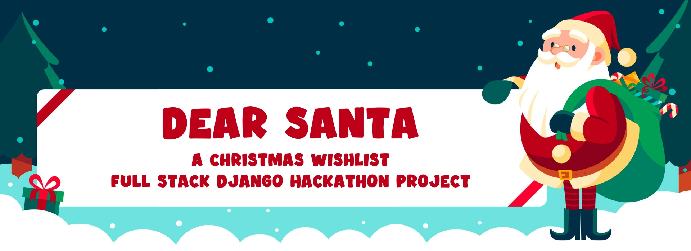
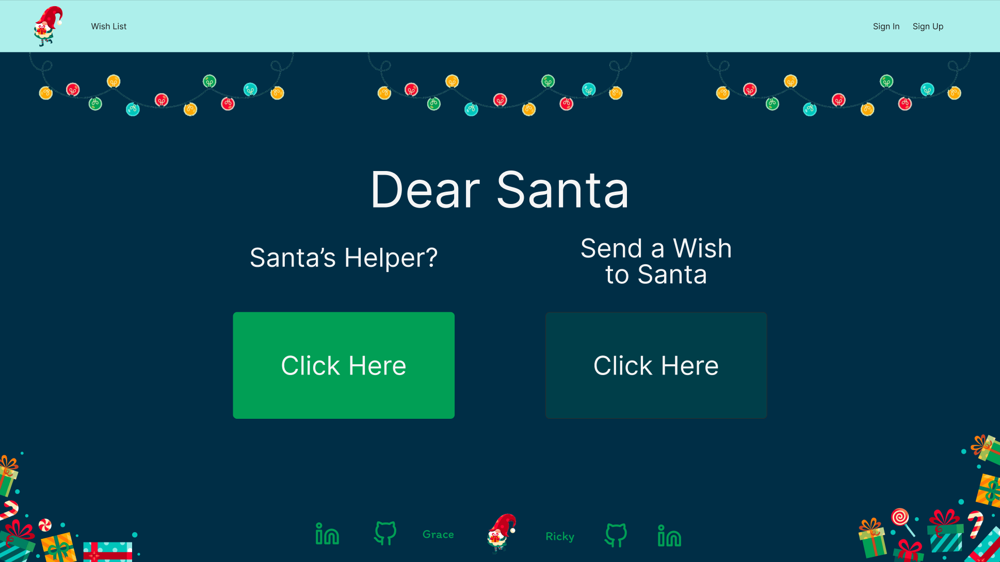
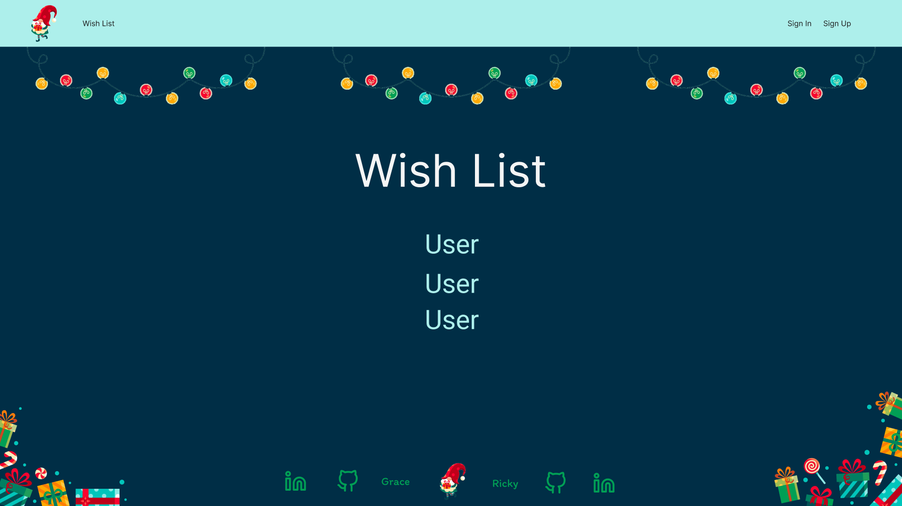
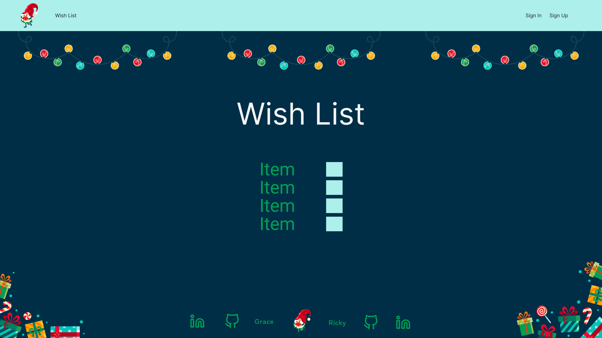
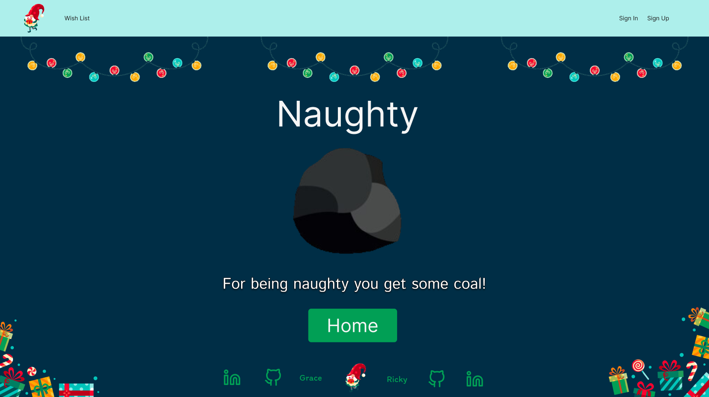
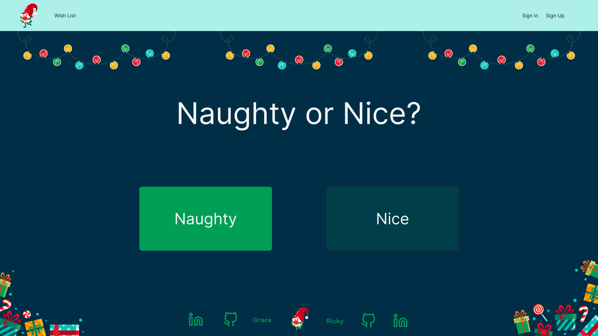
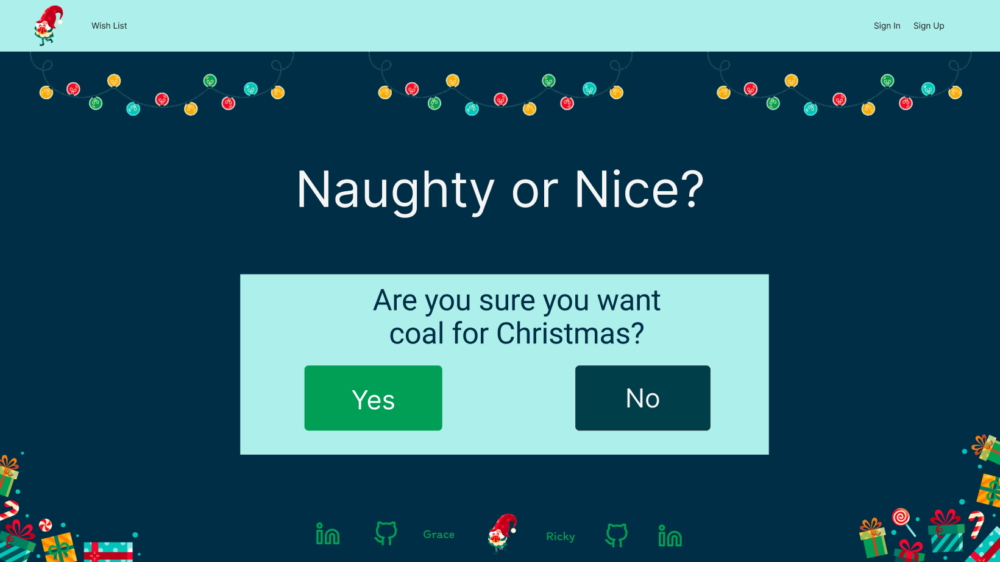
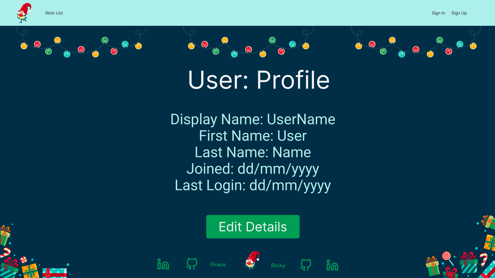

# Dear Santa


<p align="center">
| <a href="https://dear-santa-5090fb3ae7a1.herokuapp.com/">Live Project</a> |
  <a href="https://dear-santa-5090fb3ae7a1.herokuapp.com/admin">Admin Panel</a> |
  <a href="https://github.com/users/glaw2000/projects/3">Project Board</a> |
</p>

## Introduction
### Purpose
To build a full software stack application using the django framework for our final Hackathon on the Code Institute Full Stack Development Bootcamp.\
The application is called Dear Santa and is aimed at everybody that celebrates Christmas or gifts at Christmas time. The aim of the appication is to provide a user with somewhere to either input their Christmas wishes, or as a gift giver, somewhere to view other peoples' wishes. 

## Table of Contents

- [Dear Santa](#dear-santa)
  - [Introduction](#introduction)
  - [Table of Contents](#table-of-contents)
  - [Project Outline](#project-outline)
    - [Key Objectives](#key-objectives)

- [UX - User Experience](#ux---user-experience)
  - [Design Ideation](#design-ideation)
    - [Colors](#colors)
    - [Fonts](#fonts)
    - [Imagery](#imagery)

- [Project Planning](#project-planning)
  - [Agile Methodologies](#agile-methodologies)
    - [MoSCoW Prioritisation](#moscow-prioritisation)
 - [User Stories](#user-stories)
    - [Epic - Feature 1](#epic---feature-1)
    - [Epic - Feature 2](#epic---feature-2)

  - [Strategy Plane](#strategy-plane)

  - [Scope Plane](#scope-plane)

  - [Structure Plane](#structure-plane)
  
  - [Skeleton Plane](#skeleton-plane)
    - [Wireframes](#wireframes)

  - [Surface Plane](#surface-plane)
    
- [Database Schema](#database-schema)

- [Security](#security)
  - [AllAuth](#allauth)
  - [Defensive Design](#defensive-design)

- [Features](#)
  - [Feature](#)

- [Future Scope]()
  - [Future - Feature](#)

- [Built With](#built-with)
  - [Technology & Languages](#technology-and-languages)

- [Deployment](#deployment)
  - [GitHub]()
  - [Django]()
  - [PostgreSQL]()
  - [Heroku]()
  - [Clone Repo]()
  - [Fork Repo]()

- [Testing](#testing)
  - [Code Validation](#code-validation)
  - [Accessibility](#accessibility)
  - [Lighthouse Performance](#lighthouse-performance)

- [Credits](#credits)
  - [Code](#code)
  - [Acknowledgements](#acknowledgements)
  - [Appendices](#appendices)

<p align="right"><a href="#dear-santa">🔺 Back To Top</a></p>

## UX - User Experience

Provide detail about the UX principles employed within the _project_ and describe how they have been implemented in order to improve user experience. 

### Design Ideation

Expanding upon the UX section above, describe how these best practices were combined with inspiration to be effectively implemented into the design of the final _project_.

Reference any specific inspirations that heavily influenced this process.

<p align="right"><a href="#dear-santa">🔺 Back To Top</a></p>

## Colors

Description and reasoning for the colors selected as part of the _project_ as well as any additional details.

Repeat for additional palettes that may be included as part of light / dark mode or alternate themes.

### Color Palette


Explain the naming convention used for the project to aid with clean maintainable code.

| ID | Name | Type | CSS Variable | HSL | HEX |
|:-:|:-|:-|:-:|:-:|:-:|
| 1 | Eerie Black |  | `--color-` | hsl(0, 0%, 13%) | #222222 |
| 2 | Prussian Blue |  | `--color-` | hsl(201, 100%, 14%) | #002e46 |
| 3 | Viridian |  | `--color-` | hsl(165, 100%, 25%) | #008060 |
| 4 | Celeste |  | `--color-` | hsl(176, 69%, 81%) | #adf0eb |
| 5 | Imperial Red |  | `--color-` | hsl(349, 98%, 50%) | #fb032f |
| 6 | White |  | `--color-` | hsl(0, 0%, 100%) | #ffffff |

### Contrast

Provide details about the process used to ensure contrast compliance.\
Include reference to validation testing and screenshots where appropriate. 

Potential tools for contrast compliance checks.
- [Colour Contrast Checker](https://colourcontrast.cc/) also has [Chrome Extension](https://chromewebstore.google.com/detail/colour-contrast-checker/nmmjeclfkgjdomacpcflgdkgpphpmnfe)
- [WebAIM](https://webaim.org/resources/contrastchecker/)
- [Adobe](https://color.adobe.com/create/color-contrast-analyzer)

### Color Contrast Score Table

| | 1 | 2 | 3 | 4 | 5 | 6 |
|:-:|:-:|:-:|:-:|:-:|:-:|:-:|
| **1** | - | 🔴[1.12:1](https://webaim.org/resources/contrastchecker/?fcolor=222222&bcolor=002E46) | 🟠[3.22:1](https://webaim.org/resources/contrastchecker/?fcolor=222222&bcolor=008060) | 🟢[12.45:1](https://webaim.org/resources/contrastchecker/?fcolor=222222&bcolor=ADF0EB) | 🟠[3.9:1](https://webaim.org/resources/contrastchecker/?fcolor=222222&bcolor=FB032F) | 🟢[15.9:1](https://webaim.org/resources/contrastchecker/?fcolor=222222&bcolor=FFFFFF) |
| **2** | 🔴[1.12:1](https://webaim.org/resources/contrastchecker/?fcolor=002E46&bcolor=222222) | - | 🔴[2.87:1](https://webaim.org/resources/contrastchecker/?fcolor=002E46&bcolor=008060) | 🟢[11.11:1](https://webaim.org/resources/contrastchecker/?fcolor=002E46&bcolor=ADF0EB) | 🟠[3.48:1](https://webaim.org/resources/contrastchecker/?fcolor=002E46&bcolor=FB032F) | 🟢[14.19:1](https://webaim.org/resources/contrastchecker/?fcolor=002E46&bcolor=FFFFFF) |
| **3** | 🟠[3.22:1](https://webaim.org/resources/contrastchecker/?fcolor=008060&bcolor=222222) | 🔴[2.87:1](https://webaim.org/resources/contrastchecker/?fcolor=008060&bcolor=002E46) | - | 🟠[3.86:1](https://webaim.org/resources/contrastchecker/?fcolor=008060&bcolor=ADF0EB) | 🔴[1.21:1](https://webaim.org/resources/contrastchecker/?fcolor=008060&bcolor=FB032F) | 🟡[4.93:1](https://webaim.org/resources/contrastchecker/?fcolor=008060&bcolor=FFFFFF) |
| **4** | 🟢[12.45:1](https://webaim.org/resources/contrastchecker/?fcolor=ADF0EB&bcolor=222222) | 🟢[11.11:1](https://webaim.org/resources/contrastchecker/?fcolor=ADF0EB&bcolor=002E46) | 🟠[3.86:1](https://webaim.org/resources/contrastchecker/?fcolor=ADF0EB&bcolor=008060) | - | 🟠[3.18:1](https://webaim.org/resources/contrastchecker/?fcolor=ADF0EB&bcolor=FB032F) | 🔴[1.27:1](https://webaim.org/resources/contrastchecker/?fcolor=ADF0EB&bcolor=FFFFFF) |
| **5** | 🟠[3.9:1](https://webaim.org/resources/contrastchecker/?fcolor=FB032F&bcolor=222222) | 🟠[3.48:1](https://webaim.org/resources/contrastchecker/?fcolor=FB032F&bcolor=002E46) | 🔴[1.21:1](https://webaim.org/resources/contrastchecker/?fcolor=FB032F&bcolor=008060) | 🟠[3.18:1](https://webaim.org/resources/contrastchecker/?fcolor=FB032F&bcolor=ADF0EB) | - | 🟠[4.07.1](https://webaim.org/resources/contrastchecker/?fcolor=FB032F&bcolor=FFFFFF) |
| **6** | 🟢[15.9:1](https://webaim.org/resources/contrastchecker/?fcolor=FFFFFF&bcolor=222222) | 🟢[14.19:1](https://webaim.org/resources/contrastchecker/?fcolor=FFFFFF&bcolor=002E46) | 🟡[4.93:1](https://webaim.org/resources/contrastchecker/?fcolor=FFFFFF&bcolor=008060) | 🔴[1.27:1](https://webaim.org/resources/contrastchecker/?fcolor=FFFFFF&bcolor=ADF0EB) | 🟠[4.07:1](https://webaim.org/resources/contrastchecker/?fcolor=FFFFFF&bcolor=FB032F) | - |

<p align="right"><a href="#dear-santa">🔺 Back To Top</a></p>

## Typefaces

Describe the selection process and reasoning behind the typefaces used in the _project_.\
Identify any specific requirements, inspirations or difficulties faced. 

[Mountains of Christmas](https://fonts.google.com/specimen/Mountains+of+Christmas) - Default typeface with a Christmas style.\
[Sour Gummy](https://fonts.google.com/specimen/Sour+Gummy) - Complementary to the main typeface for ease of reading.\

<p align="right"><a href="#dear-santa">🔺 Back To Top</a></p>

## Imagery

During ideation of our project and deciding to include the Christmas theme we initially began with the name of _Santa's Elves_ which later changed, but did provide inspiration for image searches for a color palette and imagery for the project. 

The image below was used as the initial starting point for the favicon and banner image, which expanded into using and tweaking the remainder of the image series on [Freepik](https://www.freepik.com/serie/19507053).


<p align="right"><a href="#dear-santa">🔺 Back To Top</a></p>

## Strategy Plane

This _README Template_ provides the essential information necessary for documenting the _project_.\
This includes file & folder structure, basic placeholder information such as section headings, images, text, tables and shield buttons with links to common resources.

Once implemented the _README Template_ can be easily amended to suit the _project_ needs.

_Project Name_ was developed with the intention of - provide description of the project and scope expanding upon the introduction summary and lead into the key objectives listed below.

### Key Objectives

A brief bullet point list of the key objectives for _Project Name_.\
This could include _learning outcomes_, _stakeholder requirements_, _personal goals_ and more.

- Fulfil the primary [Learning Objectives](#) as defined by _Code Institute_.
- Objective 2

<p align="right"><a href="#dear-santa">🔺 Back To Top</a></p>

## Agile Methodologies

Agile Methodologies were followed and implemented via [GitHub Project](https://github.com/users/glaw2000/projects/3)

Buttons display current status of project issues using GitHub purple and green\
Ensure you update the `user/repo` in both the button and link

[](https://github.com/user/repo/issues?q=is%3Aissue+is%3Aclosed)
[](https://github.com/user/repo/issues?q=is%3Aopen+is%3Aissue)

### Project Prioritisation

After ideation establish required prioritisation of tasks for **MVP** delivery.

<details>
<summary>MoSCoW Priority Color Key</summary>

| Color | Priority | MoSCoW Priority Description | Implementation % |
|:-:|:-|:-|-:|
| 🟢 | **Must Have** | Absolutely **essential** elements that must be included at any cost. | Max 60% |
| 🟡 | **Should Have** | **Important** elements that should only be included with careful consideration. | Further 20% |
| 🟠 | **Could Have** | **Desirable** elements that would ideally be included if resources allow. | Final 20% |
| 🔴 | **Won't Have** | Elements that are **out-of-scope**, **unfeasible** or actively **counterproductive** | None | 

</details>

<p align="right"><a href="#dear-santa">🔺 Back To Top</a></p>

## User Stories

| ID | User Story | MoSCoW |
|:-:|:-|:-:|
| #1 | As Santa I want to know what people want so that nice people get their wishes granted | 🟢 |
| #2 | As a developer I want to create a visually attractive site so that people want to use it | 🟢 |
| #3 | As a nice person I want to be able to add my wish list so that Santa knows which gifts to deliver | 🟢 |
| #4 | As Santa I want to know who is naughty or nice so that I know who to give coal to | 🟠 |
| #5 | As Santa's helper I want to let Santa know that a gift is already under the tree for a person so that it doesn't get duplicated  | 🟡 |
| #6 | As Santa I want to know what gifts are already under the tree for a person so that I don't gift the same thing.  | 🟡 |
| #7 | As a Developer I want to provide search functionality so that it is easier for a user to find a gift recipient  | 🔴 |
| #8 | As a nice person I want to be able to hide certain items on my wish list so that only certain people can see them | 🔴 |


<p align="right"><a href="#dear-santa">🔺 Back To Top</a></p>

## Scope Plane

<p align="right"><a href="#dear-santa">🔺 Back To Top</a></p>

## Structure Plane

<p align="right"><a href="#dear-santa">🔺 Back To Top</a></p>

## Skeleton Plane

<p align="right"><a href="#dear-santa">🔺 Back To Top</a></p>

### Wireframes

**Landing**


**Wish List**


**Wish List User**


**Coal**


**Naughty or Nice**


**Naughty Confirm**


**Profile**



<p align="right"><a href="#dear-santa">🔺 Back To Top</a></p>

## Surface Plane

<p align="right"><a href="#dear-santa">🔺 Back To Top</a></p>

## Database Schema

Provide a full breakdown of the _project_ database including the entity relationship diagram (ERD)


<p align="right"><a href="#dear-santa">🔺 Back To Top</a></p>

## Security

Fully describe all measures taken to ensure security and safety within the _project_.\
Reference all implementations for front end and back end to project all users and stakeholders.

### AllAuth

### Defensive Design

### CSFR Tokens

<p align="right"><a href="#dear-santa">🔺 Back To Top</a></p>

## Features

This section should be used to showcase the features of the final _project_.

### Feature - Example

This heading provides an overview of a general feature group, providing context and description.

<details>
<summary>Specific Feature</summary>

Include detail about the specific feature, purpose and implementation.

Add screenshots where appropriate.


</details>

<p align="right"><a href="#dear-santa">🔺 Back To Top</a></p>

## Future Scope & Features

With the completion of the project describe potential future implementations.\
These could be outstanding issues, or new ideas that developed over the course of the project.

| Title | Description |
|:-:|:-|
| Feature | A desirable feature to be included in future scope implementation |

<p align="right"><a href="#dear-santa">🔺 Back To Top</a></p>

## Built With

### Technologies & Languages

[](https://www.djangoproject.com/)
[](https://www.postgresql.org/docs/release/)

[](https://developer.mozilla.org/en-US/docs/Web/HTML)
[](https://developer.mozilla.org/en-US/docs/Learn/CSS)
[](https://developer.mozilla.org/en-US/docs/Web/JavaScript)
[](https://www.python.org/doc/)

### Frameworks & Libraries

[](https://getbootstrap.com/)


[](https://github.com/Code-Institute-Org/ci-full-template)

[](https://allauth.org/)
[](https://summernote.org/)
[](https://gunicorn.org/)
[](https://pypi.org/project/psycopg2/)
[](https://whitenoise.readthedocs.io/en/stable/index.html)

### Developer Tools
[](https://www.gitpod.io/)
[](https://github.com/)
[](https://www.heroku.com/)

[](https://learn.microsoft.com/en-us/windows/powertoys/)
[](https://www.elgato.com/uk/en/s/downloads)

[](https://www.perplexity.ai/)
[](https://jsfiddle.net/)
[](https://obsidian.md)
[](https://slack.com)

[](https://affinity.serif.com/en-gb/)
[](https://www.figma.com/release-notes/)

[](https://validator.w3.org/)
[](https://jigsaw.w3.org/css-validator/)
[](https://wave.webaim.org/)
[](https://jshint.com/)
[](https://obsidian.md)

<p align="right"><a href="#dear-santa">🔺 Back To Top</a></p>

## Deployment

### Connecting to GitHub  

To begin this project from scratch, you must first create a new GitHub repository using the [Code Institute's Template](https://github.com/Code-Institute-Org/ci-full-template). This template provides the relevant tools to get you started. To use this template:

1. Log in to [GitHub](https://github.com/) or create a new account.
2. Navigate to the above CI Full Template.
3. Click '**Use this template**' -> '**Create a new repository**'.
4. Choose a new repository name and click '**Create repository from template**'.
5. In your new repository space, click the purple CodeAnywhere (if this is your IDE of choice) button to generate a new workspace.

## Django Project Setup

1. Install Django and supporting libraries: 
   
- ```pip3 install 'django<4' gunicorn```
- ```pip3 install dj_database_url psycopg2```
- ```pip3 install dj3-cloudinary-storage```  
  
2. Once you have installed any relevant dependencies or libraries, such as the ones listed above, it is important to create a **requirements.txt** file and add all installed libraries to it with the ```pip3 freeze --local > requirements.txt``` command in the terminal.  
3. Create a new Django project in the terminal ```django-admin startproject config .```
4. Create a new app eg. ```python3 mangage.py startapp blog```
5. Add this to list of **INSTALLED_APPS** in **settings.py** - 'blog',
6. Create a superuser for the project to allow Admin access and enter credentials: ```python3 manage.py createsuperuser```
7. Migrate the changes with commands: ```python3 manage.py migrate```
8. An **env.py** file must be created to store all protected data such as the **DATABASE_URL** and **SECRET_KEY**. These may be called upon in your project's **settings.py** file along with your Database configurations. The **env.py** file must be added to your **gitignore** file so that your important, protected information is not pushed to public viewing on GitHub. For adding to **env.py**:

- ```import os```
- ```os.environ["DATABASE_URL"]="<copiedURLfromPostgreSQL>"```
- ```os.environ["SECRET_KEY"]="my_super^secret@key"```
  
For adding to **settings.py**:

- ```import os```
- ```import dj_database_url```
- ```if os.path.exists("env.py"):```
- ```import env```
- ```SECRET_KEY = os.environ.get('SECRET_KEY')``` (actual key hidden within env.py)  

9. Replace **DATABASES** with:

```
DATABASES = {
    'default': dj_database_url.parse(os.environ.get("DATABASE_URL"))
  }
```

10. Set up the templates directory in **settings.py**:
- Under ``BASE_DIR`` enter ``TEMPLATES_DIR = os.path.join(BASE_DIR, ‘templates’)``
- Update ``TEMPLATES = 'DIRS': [TEMPLATES_DIR]`` with:

```
os.path.join(BASE_DIR, 'templates'),
os.path.join(BASE_DIR, 'templates', 'allauth')
```

- Create the media, static and templates directories in top level of project file in IDE workspace.

11. A **Procfile** must be created within the project repo for Heroku deployment with the following placed within it: ```web: gunicorn config.wsgi```
12. Make the necessary migrations again.

### PostgreSQL

As a Code Institue student, a new database instance can be created on PostgreSQL from Code Institute. 

- Enter CodeInstitute student email address and submit
- Retrieve the database URL value from the email generated
- Place the value within your **DATABASE_URL**  in your **env.py** file and follow the below instructions to place it in your Heroku Config Vars.


### Heroku deployment

To start the deployment process , please follow the below steps:

1. Log in to [Heroku](https://id.heroku.com/login) or create an account if you are a new user.
2. Once logged in, in the Heroku Dashboard, navigate to the '**New**' button in the top, right corner, and select '**Create New App**'.
3. Enter an app name and choose your region. Click '**Create App**'. 
4. In the Deploy tab, click on the '**Settings**', reach the '**Config Vars**' section and click on '**Reveal Config Vars**'. Here you will enter KEY:VALUE pairs for the app to run successfully. The KEY:VALUE pairs that you will need are your: 
   
   - **CLOUDINARY_URL**: **cloudinary://....** 
   - **DATABASE_URL**:**postgres://...** 
   - **DISABLE_COLLECTSTATIC** of value '1' (N.B Remove this Config Var before deployment),
   - **SECRET_KEY** and value  
  
5. Add the Heroku host name into **ALLOWED_HOSTS** in your projects **settings.py file** -> ```'8000-glaw2000-christmasfun-z7df0l0i75y.ws.codeinstitute-ide.net', '8000-glaw2000-christmasfun-3u3yj5rv7w3.ws.codeinstitute-ide.net', '.herokuapp.com'```
6. Once you are sure that you have set up the required files including your requirements.txt and Procfile, you have ensured that **DEBUG=False**, save your project, add the files, commit for initial deployment and push the data to GitHub.
7. Go to the '**Deploy**' tab and choose GitHub as the Deployment method.
8. Search for the repository name, select the branch that you would like to build from, and connect it via the '**Connect**' button.
9.  Choose '**Manual**' deployment method and click '**Deploy Branch**'.
10. Once the waiting period for the app to build has finished, click the '**View**' link to bring you to your newly deployed site. If you receive any errors, Heroku will display a reason in the app build log for you to investigate. **DISABLE_COLLECTSTATIC**  may be removed from the Config Vars once you have saved and pushed an image within your project.


## Testing

Describe the testing process, include screenshots of results and any detail error corrections required.

### Code Validation

- [W3C - Markup Validation](https://validator.w3.org/)
- [W3C - CSS Validation](https://jigsaw.w3.org/css-validator/)
- [JSHint](https://jshint.com/)

### Accessibility

- [WAVE - Web Accessibility Evaluation Tool](https://wave.webaim.org/)\

### Lighthouse Performance

- [Lighthouse Audit](https://developer.chrome.com/docs/lighthouse/overview)

<p align="right"><a href="#dear-santa">🔺 Back To Top</a></p>

## Credits

### Code

**General Resources / Learning**

- [Bootstrap](https://getbootstrap.com/docs/5.3/getting-started/introduction/)
- [Code Institute - LMS](https://codeinstitute.net/)
- [Django Docs](https://docs.djangoproject.com/en/5.1/)
- [W3Schools](https://www.w3schools.com/)

**Specific Code Used Within Project**

- [Favicon Generator](https://favicon.io/favicon-converter/) - Converting Gonk image to favicon pack
- [Perplexity AI](https://www.perplexity.ai/) - Used for assistance with debugging
- [W3Schools](https://www.w3schools.com/howto/howto_js_scroll_to_top.asp) - Scroll to top

### Media

Media credits and tools used for media editing

- [Freepik](https://www.freepik.com/serie/19507053) - Flat Christmas character, element and template set
- [Freepik](https://www.freepik.com/free-vector/coal-icons-collection_1065769.htm#fromView=search&page=1&position=6&uuid=e5a87947-ea25-443d-9ee0-a752d6d50754) - Coal


### Appendices

All additional documentation included as part of the project.\
Listed alphabetically. 

- [Testing & Validation](docs/testing.md)

### Acknowledgements

Space to thank those that helped with the projects both directly and indirectly. 

<p align="right"><a href="#dear-santa">🔺 Back To Top</a></p>
